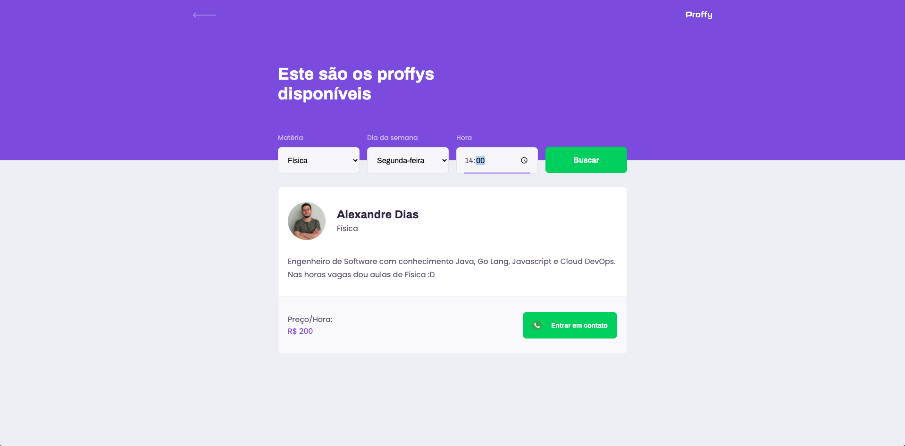

## Sobre
Este é o frontend web da aplicação **Proffy**

## O que é proffy?
**Proffy** é uma plataforma onde professores e alunos do ensino médio têm a oportunidade de se encontrar com intuito de dar/ter uma aula de reforço.
Na visão de aluno é possível filtrar pelos **dias**, **horas** e **matérias** das quais você deseja dar aulas. Já o professores poderão se registrar informando estes 3 atributos citados.

<p align="center">
  
<p>
<p align="center">
  
<p>

## Repositórios das aplicações que integram a plataforma **Proffy**
- [Backend](https://github.com/alexandrebrunodias/proffy-backend)
- [Mobile](https://github.com/alexandrebrunodias/proffy-mobile)

## Material de suporte
- [Layout](https://www.notion.so/Layout-Proffy-3d5f45f54ec54ef9b2103565b7cce4e1)
- [Preparo do Ambiente de Desenvolvimento](https://www.notion.so/Configurando-Ambiente-NLW-98a471ad3cb6448284b8ceed31c45767)

## Linguagens, frameworks e ferramentas
-  [Node.js](https://nodejs.org/en/)
-  [Typescript](https://www.typescriptlang.org/)
-  [ReactJS](https://reactjs.org/)

## Executando o projeto

###### *Para que este projeto funcione corretamente é necessário que o [backend](https://github.com/alexandrebrunodias/proffy-backend) da aplicação esteja no ar!*

```sh
  # Clone o repositório
  $ git clone https://github.com/alexandrebrunodias/proffy-web
  # Acesse o diretório da aplicação
  $ cd proffy-web
  # Instale as dependências da aplicação
  $ yarn install
  # Inicie aplicação
  $ yarn start
```